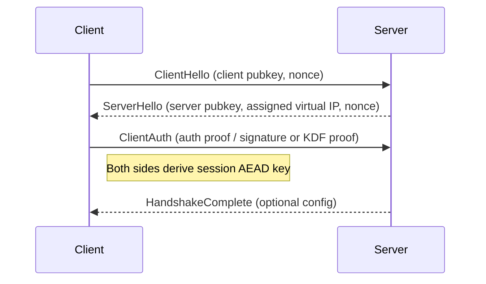
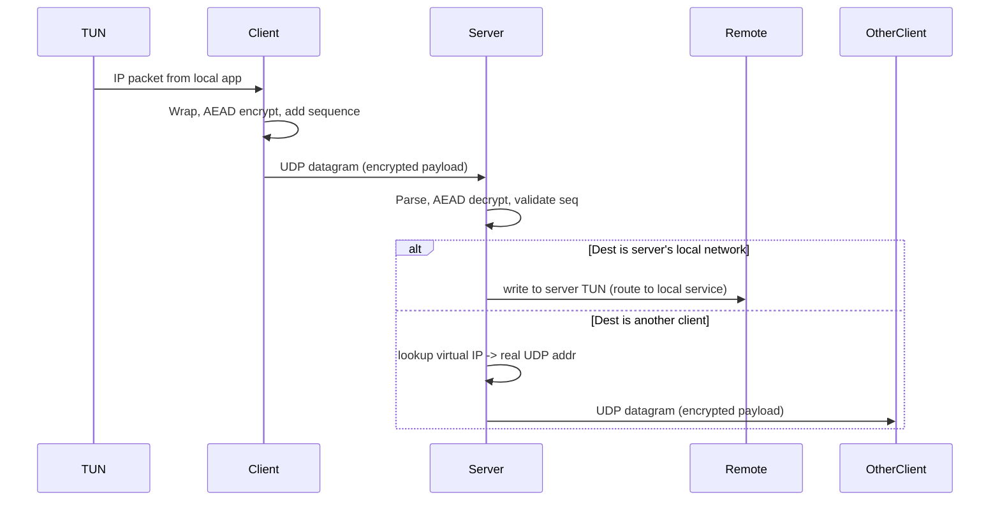
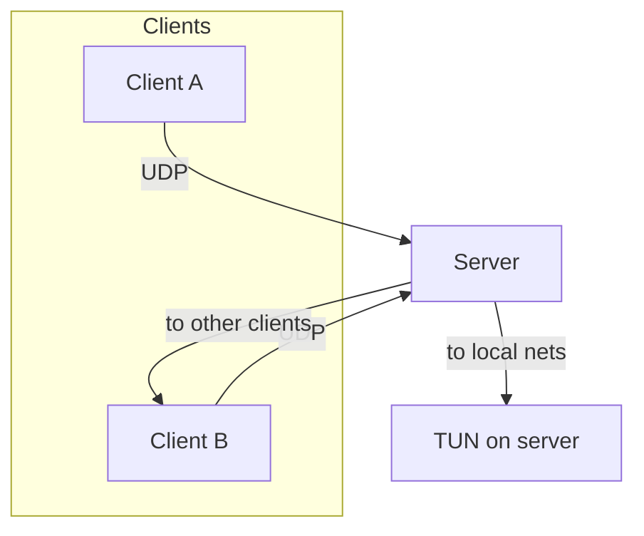
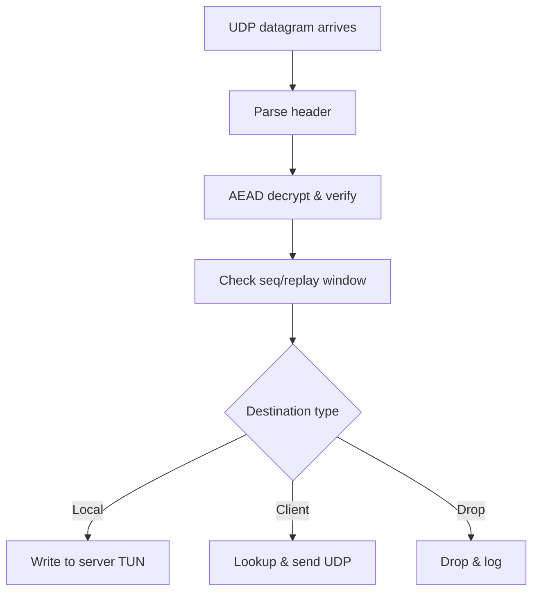

 # Simple Golang VPN — Project Overview

This repository contains a lightweight VPN experiment written in Go. It demonstrates a UDP-based, event-driven data plane with a simple authenticated handshake, a virtual IP allocation pool, and TUN integration for routing client traffic through the VPN.

## Goals
- Small, educational VPN implementation in Go
- Demonstrate key exchange, AEAD encryption of packets, and virtual IP mapping
- Provide a simple server + client architecture suitable for experimentation and learning

## Components
- `server/` — server binary and server-side logic (client manager, IP pool, UDP listener)
- `client/` — client binary that connects to server, performs handshake, and routes traffic
- `common/` — shared helpers (packet formats, crypto helpers, networking/TUN utilities)

## How it works — high level
1. Client opens a UDP socket to the server and begins a handshake (ECDH ephemeral keys). The server responds and a shared session key is derived.
2. Server allocates a virtual IP from the configured IP pool and records mapping: `real UDP addr <-> virtual IP`.
3. Client installs a TUN interface locally and routes selected traffic into the TUN. Packets read from TUN are wrapped in the project packet format, encrypted with AEAD, and sent over UDP.
4. Server receives encrypted UDP packets, decrypts and validates them, translates virtual source/destination addresses and forwards the inner IP packet to the local TUN (or to another client via UDP mapping).
5. Server maintains a control/heartbeat path for liveness and rekeying; the data plane is UDP/event-driven for performance.

## Communication flows

### 1) Handshake / session establishment (simplified)



Notes: The current code uses ephemeral ECDH; in production you should add authentication (server static key, certificate or signed exchange) to prevent MITM.

### 2) Data plane (packet flow)



## Packet/Control details
- Packets carry a small header (version, type, seq/counter) and AEAD ciphertext. The AEAD associated data should cover header fields needed for integrity.
- Maintain a per-session packet counter (or sliding window) to prevent replays.
- The server keeps two mappings: `realAddr -> client` and `virtualIP -> client`. The IP pool hands out virtual IPs and tracks allocations.

## Design choices and trade-offs
- Event-driven UDP data plane: good for low-latency, high-concurrency packet forwarding. The server consumes UDP packets and dispatches work to per-session handlers or workers.
- Control plane reliability: handshake, configuration and rekey should run over a reliable/acknowledged channel (or be layered atop the UDP channel with sequence numbers and ACKs). Keep control separate from fast data path when possible.
- Simplicity vs security: this project is intentionally small; production-grade VPNs use authenticated key exchange (WireGuard/Noise), robust anti-replay, and strict nonce management.

## Sketches / Diagrams

### Overall architecture



### Server packet processing flow



## Security notes (must-read)
- The repository currently demonstrates ECDH-based key derivation but does not include a fully authenticated exchange — it is vulnerable to MITM unless you add server authentication (static key/certs or signatures).
- AES-GCM nonce handling must ensure uniqueness per key. Prefer a monotonic counter per-session or use XChaCha20-Poly1305 for safer nonce usage.
- Add anti-replay (packet counters and a sliding window) and avoid accepting packets with duplicate sequence numbers.
- Never log raw keys or nonces in production logs.

Additional recommendations:
- Store long-term server keys in a secure file with restricted permissions or use a hardware security module (HSM) / KMS for production deployments.
- Use an authenticated handshake (server static key or certificates) or migrate to a proven protocol (Noise, WireGuard) to prevent MITM.
- Rekey periodically (time or bytes) and provide a graceful rekey handshake so clients can rotate session keys without losing connectivity.
- Define and document AEAD associated data (header fields) so replay protection and semantics are clear.
- Implement telemetry for decrypt failures and replay attempts and rate-limit or blacklist abusive sources.

## Deployment & running (examples)

Build and run server locally:

```bash
# from repo root
cd server
go run .
```

Build and run client (simple):

```bash
cd client
go run .
```

There are Dockerfiles in `server/` and `client/` if you prefer container runs — ensure to grant `NET_ADMIN` and `CAP_NET_RAW` as needed rather than running `sudo` inside containers.

Container run examples (Linux host):

```bash
# build images
docker build -t vpn-server ./server
docker build -t vpn-client ./client

# run server with network capabilities needed for TUN/iptables
docker run --rm -it --name vpn-server --cap-add=NET_ADMIN --cap-add=NET_RAW \
    -p 51820:51820/udp vpn-server

# run client with NET_ADMIN to create TUN
docker run --rm -it --name vpn-client --cap-add=NET_ADMIN --cap-add=NET_RAW \
    vpn-client
```

Notes:
- In Kubernetes or container orchestrators, prefer granting `NET_ADMIN` via PodSecurity context or use a privileged init container to configure host networking instead of running privileged long-lived containers.
- Avoid calling `sudo` from inside containers; instead grant required capabilities on container start.

## Quick run examples

Minimal local run (server and client on same machine for testing):

```bash
# open two terminals
# terminal 1: run server
cd server
go run .

# terminal 2: run client
cd client
go run .
```

Build binaries and run explicitly:

```bash
cd server
go build -o vpn-server .
./vpn-server

cd client
go build -o vpn-client .
./vpn-client -server <server-ip>:<port>
```

Debugging tips:
- Enable verbose logging in both client and server to inspect handshake messages and packet counters.
- Use `tcpdump -i any udp port 51820` (or your configured port) to observe encrypted traffic.
- Check TUN interface with `ip addr` and route settings with `ip route` on Linux.

## Next steps & recommended improvements
- Add authenticated KEX (server static key / certificates or migrate to Noise/WireGuard primitives).
- Implement per-session monotonic nonce counters and anti-replay windows.
- Add metrics (active clients, packets/s, decrypt errors), structured logs and health endpoints.
- Add unit tests for `ip_pool`, packet parsing, and crypto helpers.
- Consider splitting control plane (reliable) from data plane (fast UDP) or implement ACK/retry for handshake messages.

## Contributing
Contributions are welcome. Open an issue for design changes or security fixes first so architects can discuss.

---

If you'd like, I can also:
- produce PNG/SVG renderings of the Mermaid diagrams and add them to the repo,
- convert handshake to an authenticated Noise pattern, or
- implement per-session monotonic nonces and anti-replay in the server code.

Which of those would you like next?
